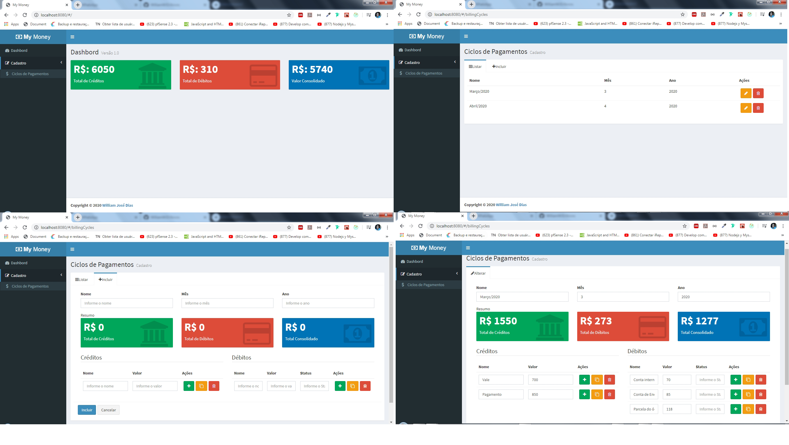

<h1 align="center">My Money - Ciclos de Pagamentos</h1>

<h1 align="center">
    
</h1>

## 💻 Projeto
O My Money é um app desenvolvido durante o curso de React + Redux, a aplicação tem como objetivo principal controlar os créditos e os débitos do usuário.

## ☕ Funcionalidades
 - Cadastro de ciclos de pagamento
 - Cadastro de créditos
 - Cadastro de débitos

## :pushpin: Tecnologias
Projeto desenvolvido com as seguintes tecnologias:

- NodeJS
- MongoDB
- ReactJS
- Redux
- Redux Form
- Template Admin - LTE (Bootstrap)

## 🚀 Instalação e execução do backend
1. Faça o download do projeto
2. Na pasta backend rode o comando `yarn` para instalar todas as dependências necessárias
3. Crie um arquivo `.env` seguindo a base do `.env.example`
4. Rode o comando `yarn dev` para subir o servidor

## 💻 Instalação e execução do frontend
1. Acesse a pasta frontend e rode o comando `yarn` para instalar todas as dependências necessárias
2. Rode o comando `yarn dev`
3. Acesse o endereço: `http://localhost:8080` 

## 🤔 Como contribuir

- Faça um fork desse repositório;
- Cria uma branch com a sua feature: `git checkout -b minha-feature`;
- Faça commit das suas alterações: `git commit -m 'feat: Minha nova feature'`;
- Faça push para a sua branch: `git push origin minha-feature`.

## :memo: Licença

Esse projeto está sob a licença MIT. Veja o arquivo [LICENSE](LICENSE.md) para mais detalhes.

---

Desenvolvido por [William José Dias!](https://github.com/WilliamWJD)